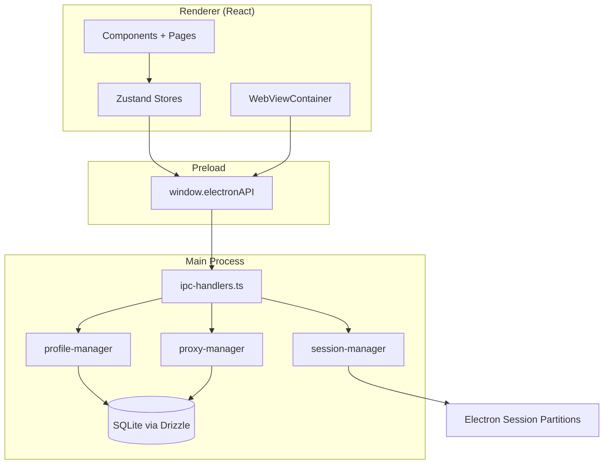

# Implementation Plan: Ollo MVP

<aside>
📋

**Source specification:** Ollo MVP – Task Plan for Cursor AI (provided in Cursor chat, June 2026)

**Project state:** Phase 1 complete (Jun 9, 2026). electron-vite template scaffolded, deps installed, Tailwind v4 + aliases + webviewTag configured. `npm run typecheck` and `npm run build` pass.

**Execution order:** Complete tasks sequentially within each phase; phases are ordered by dependency.

</aside>

## Overview

Build **Ollo**, a multi-profile browser manager MVP using **Electron 33+ / electron-vite 2+ / React 19 / TypeScript 5 / Tailwind CSS v4 / Zustand 5 / better-sqlite3 / Drizzle ORM**. Each browser profile runs in an isolated `<webview>` with a persistent partition (`persist:profile_<id>`). Proxy and extension setup happen in the main process before the webview loads.

## Technical Approach

### Architecture



### Key decisions

| Decision | Choice | Rationale |
| --- | --- | --- |
| ID generation | `crypto.randomUUID()` | Native, no extra deps; works in main process |
| DB location | `app.getPath('userData')/ollo.db` | Per-user persistent storage |
| Profile isolation | Single BrowserWindow + `<webview>` tags | Required by project rules; avoids multi-window overhead |
| Proxy testing | HTTP/HTTPS only via native `fetch` | SOCKS5 stored but not tested in MVP |
| Extensions storage | `settings` table JSON field or `profile_extensions` join | Simple manual path entry for MVP |
| IPC naming | `object:action` channels | Consistent with electron-ipc skill |

### Target file structure

```
src/
  main/
    index.ts
    ipc-handlers.ts
    db/
      schema.ts
      index.ts
    services/
      profile-manager.ts
      proxy-manager.ts
      session-manager.ts
  preload/
    index.ts
  renderer/
    main.tsx
    App.tsx
    assets/index.css
    lib/utils.ts
    components/
      MainLayout.tsx
      ProfileList.tsx
      ProfileForm.tsx
      ProxyForm.tsx
      WebViewContainer.tsx
      ExtensionManager.tsx
      Toast.tsx
    pages/
      DashboardPage.tsx
    store/
      useProfileStore.ts
      useProxyStore.ts
      useUIStore.ts
      useToastStore.ts
  shared/
    types.ts
drizzle.config.ts
electron.vite.config.ts
```

---

## Phase 1: Project Setup & Configuration

**Skill:** `electron-vite`, `react-tailwind`, `webview`

- [x]  **Task 1.1 — Initialize electron-vite project** ✅
    - Run `npm create @quick-start/electron@latest ollo -- --template react-ts` (or scaffold in existing repo)
    - Install: `better-sqlite3 drizzle-orm zustand immer clsx tailwind-merge lucide-react`
    - Dev deps: `drizzle-kit @types/better-sqlite3`
    - Run `npm install`
    - **Verify:** `npm run dev` launches Electron window
- [x]  **Task 1.2 — Configure Tailwind CSS v4** ✅
    - Install `tailwindcss @tailwindcss/vite`
    - Add Tailwind plugin to renderer in `electron.vite.config.ts`
    - Create `src/renderer/assets/index.css` with `@import "tailwindcss"`
    - Import CSS in `src/renderer/main.tsx`
    - Create `src/renderer/lib/utils.ts` with `cn()` helper (clsx + tailwind-merge)
    - **Verify:** Tailwind utility classes render in App
- [x]  **Task 1.3 — Path aliases & TypeScript** ✅
    - `electron.vite.config.ts`: `@` → `src/renderer`, `@main` → `src/main`
    - Update `tsconfig.web.json` and `tsconfig.node.json` paths
    - **Verify:** Imports resolve without TS errors
- [x]  **Task 1.4 — Enable webview support** ✅
    - In `src/main/index.ts`, set `webPreferences: { webviewTag: true }`
    - **Verify:** `<webview>` can be created in renderer (no console error)

---

## Phase 2: Database Layer

**Skill:** `drizzle-better-sqlite3`

- [ ]  **Task 2.1 — Database schema** (`src/main/db/schema.ts`)
    - Tables: `profiles`, `proxies`, `groups`, `settings`
    - **profiles:** id, name, notes, groupId, proxyId, userAgent, tags (JSON text), status, createdAt, updatedAt
    - **proxies:** id, type (http/https/socks5), host, port, username, password, createdAt, updatedAt
    - **groups:** id, name, color (optional), createdAt, updatedAt
    - **settings:** id (singleton key), extensions (JSON array of paths), createdAt, updatedAt
    - Use `text('id').primaryKey()` with `crypto.randomUUID()` at insert time
    - Timestamps: `integer` with `{ mode: 'timestamp' }`
- [ ]  **Task 2.2 — DB connection** (`src/main/db/index.ts`)
    - Singleton `better-sqlite3` + `drizzle()` instance
    - Path: `join(app.getPath('userData'), 'ollo.db')`
    - Export `db`, `getDbPath()`, `initDatabase()`
    - Auto-create file on first connect
- [ ]  **Task 2.3 — Initial migration**
    - Create `drizzle.config.ts` pointing to schema + `userData` path
    - Add npm script: `"db:push": "drizzle-kit push"`
    - Run migration on app startup via `initDatabase()`
    - **Verify:** `ollo.db` created with all tables

---

## Phase 3: Main Process Services

**Skills:** `drizzle-better-sqlite3`, `webview`

- [ ]  **Task 3.1 — Profile Manager** (`src/main/services/profile-manager.ts`)
    - `createProfile`, `getAllProfiles`, `getProfileById`, `updateProfile`, `deleteProfile`, `bulkDeleteProfiles`
    - Sync functions (better-sqlite3 is sync)
    - Named exports, typed DTOs from `@shared/types`
- [ ]  **Task 3.2 — Proxy Manager** (`src/main/services/proxy-manager.ts`)
    - CRUD: `createProxy`, `getAllProxies`, `updateProxy`, `deleteProxy`
    - `testProxy(proxy)` → `{ success, ip?, country?, error? }`
    - Test URL: `http://ip-api.com/json` via native `fetch`
    - HTTP/HTTPS: use `ProxyAgent` or Electron `net` module with proxy config
    - SOCKS5: store only; return `{ success: false, error: 'SOCKS5 test not supported in MVP' }`
- [ ]  **Task 3.3 — Session Manager** (`src/main/services/session-manager.ts`)
    - `setProxyForPartition(partition, proxyConfig)` — `session.fromPartition(partition).setProxy()`
    - `loadExtensionForPartition(partition, extensionPath)` — `session.loadExtension()`
    - `setupPartition(profileId, proxyId?, extensionPaths?)` — orchestrates both before webview load
    - Partition format: `persist:profile_<profileId>`

---

## Phase 4: IPC Handlers & Preload

**Skill:** `electron-ipc`

- [ ]  **Task 4.1 — IPC handlers** (`src/main/ipc-handlers.ts`)
    - Channels:
        - `profile:create`, `profile:list`, `profile:get`, `profile:update`, `profile:delete`, `profile:bulk-delete`
        - `proxy:create`, `proxy:list`, `proxy:update`, `proxy:test`, `proxy:delete`
        - `session:setup`, `profile:start`
        - `config:export`, `config:import` (for JSON export/import)
    - Input validation (type/length checks)
    - Return `{ success, data?, error? }` pattern for serializable errors
    - Register in `src/main/index.ts` on `app.whenReady()`
- [ ]  **Task 4.2 — Preload script** (`src/preload/index.ts`)
    - `contextBridge.exposeInMainWorld('electronAPI', { ... })`
    - Typed methods matching all IPC channels
    - Add `src/preload/index.d.ts` or extend `Window` interface
- [ ]  **Task 4.3 — Shared types** (`src/shared/types.ts`)
    - Interfaces: `Profile`, `Proxy`, `Group`, `Settings`, `CreateProfileDTO`, `CreateProxyDTO`, `ProxyTestResult`, `IpcResult<T>`
    - Use `interface` for shapes, `type` for unions (`ProxyType`, `ProfileStatus`, `ActiveView`)

---

## Phase 5: State Management (Zustand)

**Skill:** `zustand`

- [ ]  **Task 5.1 — Profile Store** (`src/renderer/store/useProfileStore.ts`)
    - State: `profiles`, `selectedProfileId`, `runningProfileIds: Set<string>`
    - Actions: `setProfiles`, `addProfile`, `removeProfile`, `selectProfile`, `updateProfile`, `setProfileStatus`
    - Immer middleware; IPC calls stay in components
- [ ]  **Task 5.2 — Proxy Store** (`src/renderer/store/useProxyStore.ts`)
    - State: `proxies`, `lastTestResult: ProxyTestResult | null`
    - Actions: `setProxies`, `addProxy`, `removeProxy`, `setTestResult`
- [ ]  **Task 5.3 — UI Store** (`src/renderer/store/useUIStore.ts`)
    - State: `sidebarOpen`, `activeView` ('dashboard' | 'profiles' | 'proxies' | 'settings')
    - Actions: `toggleSidebar`, `setActiveView`

---

## Phase 6: UI Components

**Skills:** `react-tailwind`, `electron-ipc`, `webview`, `zustand`

- [ ]  **Task 6.1 — Main Layout** (`src/renderer/components/MainLayout.tsx`)
    - Sidebar nav: Dashboard, Profiles, Proxies, Settings
    - Main content area; responsive with Tailwind
    - lucide-react icons for nav items
- [ ]  **Task 6.2 — Dashboard Page** (`src/renderer/pages/DashboardPage.tsx`)
    - Summary cards: total profiles, running profiles, proxy count
    - Data from Zustand stores (loaded on mount via IPC)
- [ ]  **Task 6.3 — Profile List** (`src/renderer/components/ProfileList.tsx`)
    - Fetch `profile:list` on mount → Zustand
    - Cards: name, status, proxy info, group tag
    - Actions: Start, Stop, Edit, Delete
    - Start → `profile:start` IPC → open WebViewContainer
- [ ]  **Task 6.4 — Profile Form** (`src/renderer/components/ProfileForm.tsx`)
    - Modal: name, notes, group selector, proxy selector, user-agent, tags
    - Submit → `profile:create` or `profile:update`
- [ ]  **Task 6.5 — Proxy Form** (`src/renderer/components/ProxyForm.tsx`)
    - Fields: type, host, port, username, password
    - Test button → `proxy:test` → display IP/country or error
    - Save → `proxy:create`
- [ ]  **Task 6.6 — WebView Container** (`src/renderer/components/WebViewContainer.tsx`)
    - Imperative `<webview>` creation via `useRef` + `useEffect`
    - Call `session:setup` **before** setting `src`
    - `partition="persist:profile_<profileId>"`
    - `dom-ready` → update profile status to `running`
    - Unmount → remove webview, status → `stopped`
- [ ]  **Task 6.7 — Extension Manager** (`src/renderer/components/ExtensionManager.tsx`)
    - Manual path input for unpacked extension directories
    - Persist paths in DB settings; load on `session:setup`
- [ ]  **Task 6.8 — Bulk Actions**
    - Checkboxes on ProfileList for multi-select
    - Bulk delete → `profile:bulk-delete`
    - Export/import JSON via `dialog.showOpenDialog` / `showSaveDialog` in main process

---

## Phase 7: Integration & Testing

**Skills:** all

- [ ]  **Task 7.1 — Wire everything together**
    - `src/main/index.ts`: init DB, register IPC, create window with webviewTag
    - `src/renderer/App.tsx`: conditional views from `useUIStore`, embed MainLayout
    - End-to-end test: create profile → assign proxy → start → webview loads
- [ ]  **Task 7.2 — Error handling & notifications**
    - `useToastStore` + `Toast.tsx` component (no external lib)
    - Wrap IPC calls in try/catch; show success/error toasts
- [ ]  **Task 7.3 — Final review & cleanup**
    - Eliminate all `any` types
    - Remove unused imports
    - Confirm named exports everywhere
    - Run `npm run build` successfully

---

## Dependencies

| Dependency | Required before |
| --- | --- |
| Phase 1 complete | All subsequent phases |
| Phase 2 (schema + DB) | Phase 3 services |
| Phase 3 services | Phase 4 IPC handlers |
| Phase 4 IPC + shared types | Phase 5 stores, Phase 6 UI |
| Phase 5 stores | Phase 6 components (data binding) |
| Phase 6 WebView + Session | Phase 7 integration test |

## Risks & Mitigations

| Risk | Impact | Mitigation |
| --- | --- | --- |
| better-sqlite3 native rebuild fails | App won't start | Use `externalizeDepsPlugin()`; set `npmRebuild: false` in electron-builder.yml if needed |
| Proxy test via fetch in main process | HTTP proxy auth may not work with plain fetch | Use Electron `net.request` with proxy rules, or `undici` ProxyAgent as fallback |
| React doesn't support `<webview>` JSX | Runtime errors | Imperative DOM creation per webview skill |
| Extension load timing | Extensions not active on first navigation | Load extensions in `setupPartition` before setting webview src; await all `loadExtension` calls |
| Large profile export/import | Data loss on malformed JSON | Validate schema on import; transactional DB writes |

## Acceptance Criteria (MVP)

- [ ]  Create, edit, delete profiles with notes, groups, tags, user-agent
- [ ]  Assign HTTP/HTTPS/SOCKS5 proxy to profile (SOCKS5 test optional)
- [ ]  Test HTTP/HTTPS proxy from main process, show IP/country
- [ ]  Start profile in isolated webview with persistent partition
- [ ]  Load unpacked extensions per profile
- [ ]  Bulk delete profiles
- [ ]  Export/import profiles + proxies as JSON
- [ ]  No `any` types; all IPC via preload bridge
- [ ]  No fingerprint, cloud, license, or automation API features

---

## Skill Reference Map

| Phase / Task | Skill file |
| --- | --- |
| 1.1–1.3 | `.cursor/skills/electron-vite/SKILL.md` |
| 1.2, 6.x UI | `.cursor/skills/react-tailwind/SKILL.md` |
| 1.4, 3.3, 6.6 | `.cursor/skills/webview/SKILL.md` |
| 2.x, 3.1–3.2 | `.cursor/skills/drizzle-better-sqlite3/SKILL.md` |
| 4.x | `.cursor/skills/electron-ipc/SKILL.md` |
| 5.x | `.cursor/skills/zustand/SKILL.md` |
| All phases | `.cursor/rules/ollo-core.mdc` |